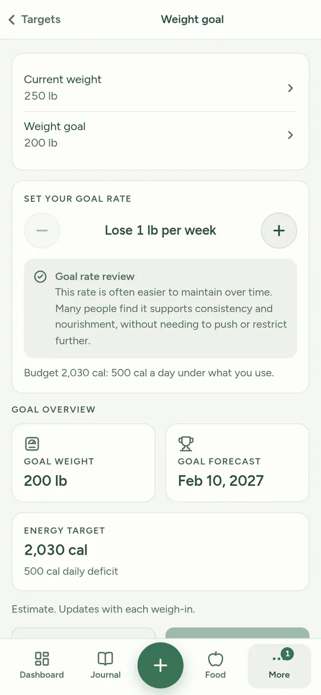
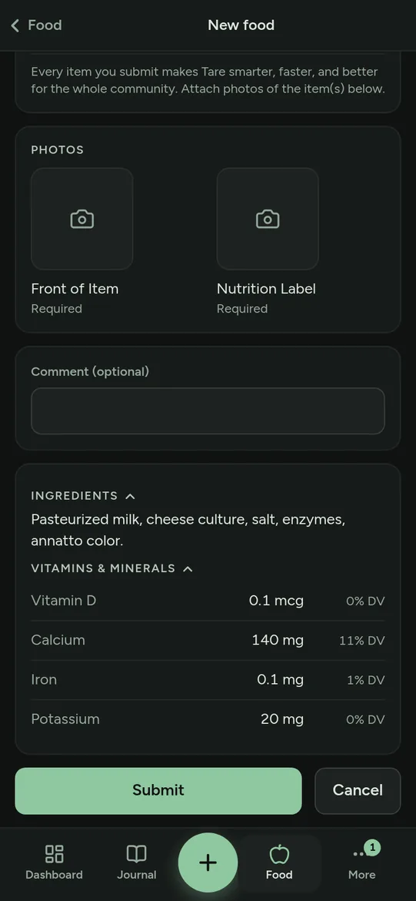
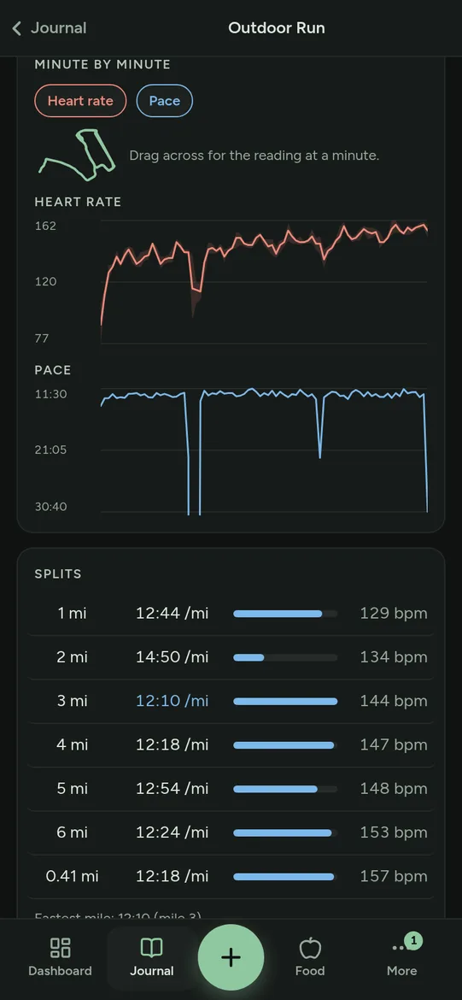

# Tare

[](LICENSE)

Tare is a food journal and health tracker with a community-built food database. The database starts completely empty. Every food in it was entered by a member and checked by a person before it was published, so the database grows more useful the longer Tare has been running and the less it resembles a generic product catalogue.

Scanning a barcode is the only online step a member ever sets off. A code nobody has entered yet is asked of an online source, and what comes back waits for a reviewer to approve it before it joins the shared database. The one other lookup belongs to an administrator: a food that is already approved can have its vitamins and minerals matched by name against USDA FoodData Central, and an administrator picks the right record by hand. The only other traffic out is a notification, which goes to the push service the member's own browser named, encrypted so that service cannot read it. Nothing else leaves the server, and nothing enters the database without a person deciding it should.

Beside the journal, Tare records weight, exercise, and the step and workout data a phone sends in, and shows a read-only feed of what the friends you choose have logged. Accounts are created by invitation.

Tare is open source under the AGPL and can be self-hosted; see Running it below.

This project was built with Claude Code, an agentic coding platform, through hundreds of human iterations and thousands of prompts.

## Status

Early development, and most of it is running. Accounts come from an invite link that carries one to ten seats, an emailed verification stands in front of the app until the address is confirmed, and a guided setup and a welcome tour start a member off.

The journal takes private custom foods, meals, recipes, daily foods that log themselves, and a day that can be marked complete. The shared database is browsed by aisle or found by barcode with the camera, carries label photos, takes reports on anything wrong with a food, and everything joining it passes an approval queue worked by two roles, administrator and reviewer, whose every decision is written to a review log. Foods carry vitamins and minerals per serving, filled from an administrator's USDA match picker where a barcode did not supply them.

Calorie and macro targets are worked out from a weight goal, with weigh-ins and body measurements behind them. Health sync brings in what a phone records, through Health Auto Export or an uploaded file, and workouts arrive with their routes and an optional map.

A calendar sits beside the journal. An appointment takes a time or a whole day, can run across several days, and can repeat by week, month or year; the month, one day against the clock, and today's hours at the top of the Dashboard are the three ways to read it. A calendar can be shared with a friend by invitation, and either of you can add another friend, rename it or recolor it; leaving one takes your own appointments with you. A friend can also be invited to a single appointment, and anything already in that hour is named before either is saved. On an instance that holds push keys, a change to a calendar you share and an invitation to an appointment reach your devices as notifications, and a timed appointment can remind you fifteen or thirty minutes before it starts, a switch of its own. Your calendar is private: only appointments you add to a shared calendar, or invite a friend to, are seen by anyone else.

Beside all of that: a library of stretches and moves, member profiles with avatars, friends by mutual request, a read-only community feed carrying only what was shared, with a switch over every part of it and the same switches on each workout of your own, and a feedback line to the administrator. It installs as a PWA, and once installed it can send a morning and an evening check-in, a weekly note when the journal has gone quiet, a weekly Biometrics nudge, appointment reminders and calendar changes, each of them switchable under More, then Notifications.

## Screenshots

| Weight goal | Scanned barcode | A workout |
|---|---|---|
|  |  |  |

## Running it

```
cp .env.example .env
```

Edit `.env` and replace the placeholders, at minimum `POSTGRES_PASSWORD` and `SECRET_KEY`. The api refuses to start while either is still the example value, and Postgres only reads its password the first time it creates the data directory, so set it before the first start.

Tare offers US time zones only, so `TARE_TZ` is one of the seven the file lists.

Make the tiles folder before the first start. Compose bind-mounts `./tiles` into the web container, and Docker creates a missing bind-mount source itself, owned by root:

```
mkdir tiles
```

```
docker compose up -d --build
```

The api listens on `127.0.0.1:8200` and the web front end on `127.0.0.1:8210`. Nothing is published beyond loopback, so reaching an instance from elsewhere means putting a reverse proxy in front of it. With nothing in front of the web container set `TRUSTED_PROXY_HOPS=0`, or every caller shares one rate-limit bucket.

There is deliberately no way to make the first account from a browser. Make it from a shell, which prompts for the password rather than taking it as an argument:

```
docker compose exec api python manage.py create-admin --username you --birthdate 1990-01-15 --email you@example.com
```

Then mint an invite link for everybody else. One code lets one person in unless `--seats N` says otherwise, up to ten:

```
docker compose exec api python manage.py create-invite --seats 4
```

Notifications are off until the instance holds a pair of keys of its own. Mint them, put both printed lines in `.env`, and recreate the api so it reads them:

```
docker compose run --rm --no-deps api python manage.py vapid-keys
docker compose up -d api
```

Without them the Notifications screen says they are not set up, and nothing else changes.

For a real deployment, with the proxy, the first account, backups and what each setting does, see [docs/DEPLOY.md](docs/DEPLOY.md).

To work on the front end against a running api:

```
cd frontend && npm install && npm run dev
```

That serves on port 5190 and forwards `/api` to `127.0.0.1:8200`.

The development compose file is opt-in rather than automatic. It publishes Postgres on `127.0.0.1:55434` and runs Mailpit on `127.0.0.1:8225`, a mail catcher that accepts every message the api sends and delivers none of them:

```
docker compose -f docker-compose.yml -f docker-compose.dev.yml up -d
```

## Checks

The backend, in a Python 3.14 virtual environment:

```
cd backend
python3 -m venv .venv && . .venv/bin/activate
pip install --require-hashes -r requirements.txt
pip install -r requirements-dev.txt
ruff check . && mypy && pytest -q
```

Then the dependency audit, which reads the locked runtime list rather than what is installed:

```
pip install pip-audit
pip-audit --no-deps -r requirements.txt
```

The front end:

```
cd frontend
npm ci && npm run lint && npm run build && npm audit --omit=dev
```

CI runs the same commands on every push, and again once a week so the audits still run when nobody has pushed. It also parses the compose file and builds both images.

## Docs

- [docs/DEPLOY.md](docs/DEPLOY.md) is the deployment guide: settings, the proxy, the first account, map tiles, backups.
- [docs/INGEST.md](docs/INGEST.md) is how a phone's health export reaches an instance, and what happens to it.
- [docs/HEALTH-MATH.md](docs/HEALTH-MATH.md) is the specification for every number Tare computes, with its sources.
- [docs/STRETCHES.md](docs/STRETCHES.md) is the stretch and mobility library and where its entries come from.
- [docs/screenshots.md](docs/screenshots.md) is the shot list for the invite page, and how each one is taken.

## Data sources

The barcode scanner first searches the Tare database for existing items. If it doesn't exist, it searches Open Food Facts, whose data is available under the Open Database License (ODbL). Once an item is approved, it's stored on Tare's server and doesn't have to reach out to the internet.

Vitamins and minerals can also come from USDA FoodData Central, which is public domain. Only an administrator reaches it, and only to match a food that is already approved and has no vitamins on it yet; a member's scan never does, and an instance without a FoodData Central key never does at all.

Notifications travel through the push service the member's own browser named, which is Apple, Google or Mozilla depending on the browser. The body is encrypted for that device before it leaves, so the service carries it without being able to read it.

Calorie and nutrient targets follow the Dietary Guidelines for Americans and the American Heart Association. Tare uses math to make estimates, and does not provide medical advice. Talk to your doctor/clinician before changing how you eat, especially if pregnant, breastfeeding, under care for a medical condition, or have a history of eating disorders.

## License

AGPL-3.0-or-later. See LICENSE. Copyright (C) 2026 Lazarus Labs.

Developed by Lazarus Labs, https://lazaruslinux.com
